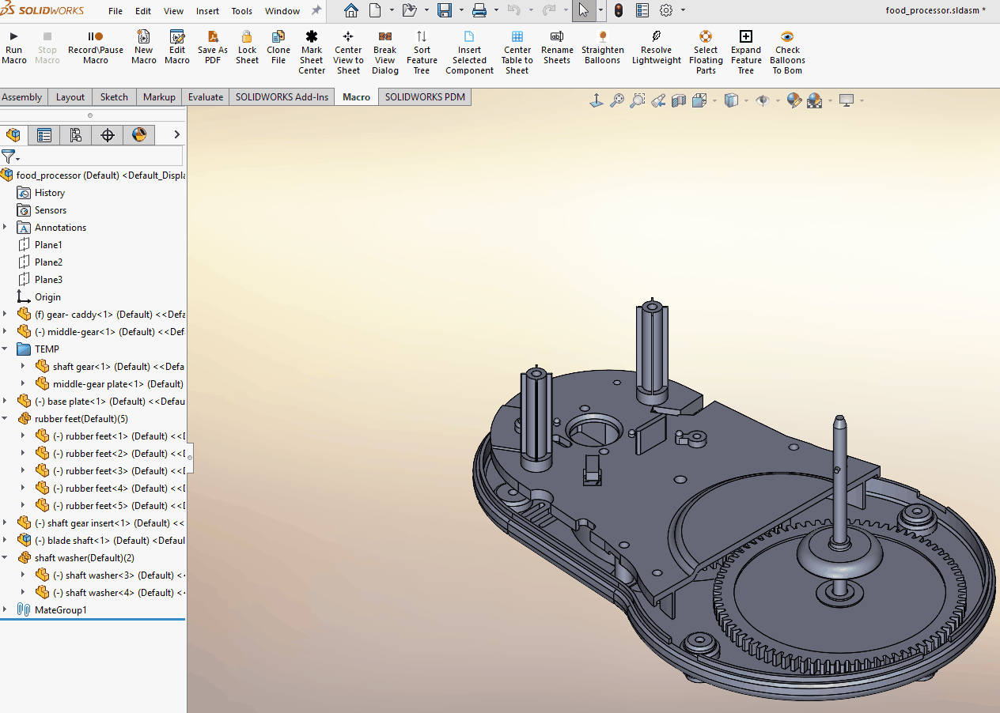

# ExpandFeatureTree — SolidWorks Macro

## Purpose
Automatically expands grouped component instances and feature folders in the
SolidWorks FeatureManager tree to improve assembly visibility and navigation.

## Problem
SolidWorks provides options to collapse items in the FeatureManager tree
(grouped component instances, folders, mate folders, etc.), but does not provide
a native option to quickly expand them again. In large assemblies, this can make
it difficult to identify hidden, suppressed, or patterned components efficiently.

While mate folders can become excessively long and cluttered when expanded,
grouped component instances and feature folders are often essential for
understanding assembly structure and component state.

## Solution
This macro expands grouped component instances and feature folders in the
FeatureManager tree while intentionally leaving mate folders collapsed.
This provides improved visibility without introducing unnecessary noise.

The macro:
- Expands grouped component instances
- Expands feature folders
- Improves visibility of hidden and suppressed parts
- Skips mate folders to preserve tree readability
- Executes quickly, even in large assemblies

## Demo

## How It Works (High‑Level)
1. Macro scans the FeatureManager design tree
2. Identifies expandable group and folder nodes
3. Programmatically expands only relevant tree items
4. Skips mate folders to maintain usability

## Why This Matters
- Quickly exposes hidden or suppressed components
- Eliminates repetitive manual tree expansion
- Improves situational awareness in complex assemblies
- Demonstrates thoughtful automation balanced with usability

## Files
- `ExpandFeatureTree.swp` — Executable SolidWorks macro
- `ExpandFeatureTree.bas` — Readable source code
- `ExpandFeatureTree.gif` — Visual demonstration

*(Demonstration uses non‑proprietary sample assemblies.)*
