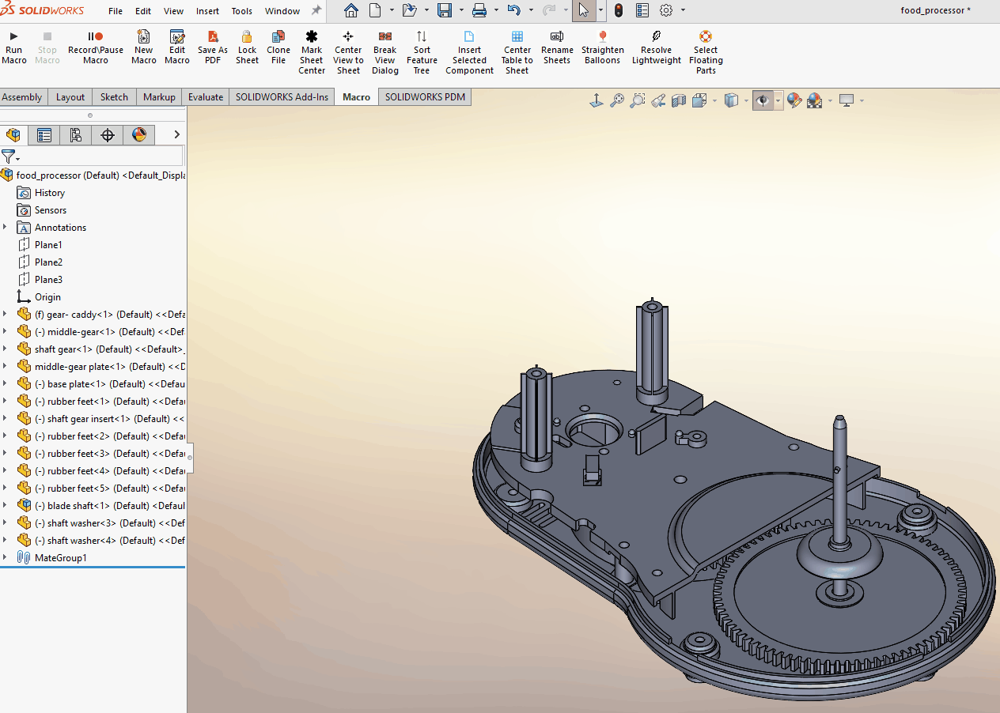

# InsertSelectedComponent — SolidWorks Macro

## Purpose

Provides a fast, low‑friction way to insert one or more copies of a selected
component into a SolidWorks assembly without requiring immediate attention to
mates or placement.

The macro is designed for early‑stage layout work, rough assembly construction,
and situations where components simply need to exist in the assembly so that
relationships can be addressed later.

---

## Problem

SolidWorks offers several ways to insert components into an assembly—including
the Insert Component command, Ctrl‑dragging from the FeatureManager tree,
pattern features, and Copy with Mates. While powerful, these tools are often
optimized for final placement, mate definition, or patterned behavior.

In practice, there are many situations where an engineer simply needs to bring
in **one or multiple copies of a component quickly**, without worrying about
mates, positioning accuracy, or placement intent at that moment.

Common scenarios include:
- Rough assembly layout and space planning
- Adding placeholder hardware or repeated components
- Early modeling stages where mate strategy is not yet finalized
- Iterative design where components may be deleted or repositioned later

Using existing insertion methods in these cases can add unnecessary steps,
interrupt design flow, and slow down iteration when the immediate goal is simply
to populate the assembly.

---

## Solution

This macro streamlines the insertion process by allowing the user to **select a
component first**, then specify the desired number of copies using a simple input
form.

The macro uses the active selection to determine what component to insert and
handles multiple insertions automatically, eliminating repeated manual steps.

The macro:

- Requires a selected component (part or subassembly)
- Prompts the user for the number of copies to insert
- Inserts all requested instances into the active assembly
- Gracefully handles cancellation
- Uses a clean, non‑blocking user input form

---

## Demo

---

## How It Works (High‑Level)

1. Verifies that the active document is an assembly
2. Reads the currently selected component
3. Displays a form prompting for the number of copies to insert
4. If cancelled, exits safely without modifying the assembly
5. Inserts the selected component the specified number of times
6. Leaves placement and mating to the user as needed

---

## User Input Form (`frmCopies`)

The macro uses a simple user form to capture copy count input:

- SpinButton with defined minimum and maximum values
- TextBox synchronized with the SpinButton
- OK button to confirm insertion
- Cancel button and window close handling to exit safely

This ensures valid input while keeping user interaction minimal.

---

## Why This Matters

- Speeds up repetitive component insertion tasks
- Reduces UI friction during assembly creation
- Improves focus when working with repeated components
- Provides a predictable, repeatable insertion workflow
- Demonstrates clean macro‑UI integration using VBA forms

---

## Compatibility

- SolidWorks assemblies only
- Requires an actively selected component
- Tested with SolidWorks 2025
- Written in VBA

---

## Files

- `InsertSelectedComponent.swp` — Executable SolidWorks macro  
- `InsertSelectedComponent.bas` — Readable source code  
- `frmCopies.frm` — User input form for copy count  
- `InsertSelectedComponent.gif` — Visual demonstration

---

*Demonstration performed using non‑proprietary sample assemblies.*
