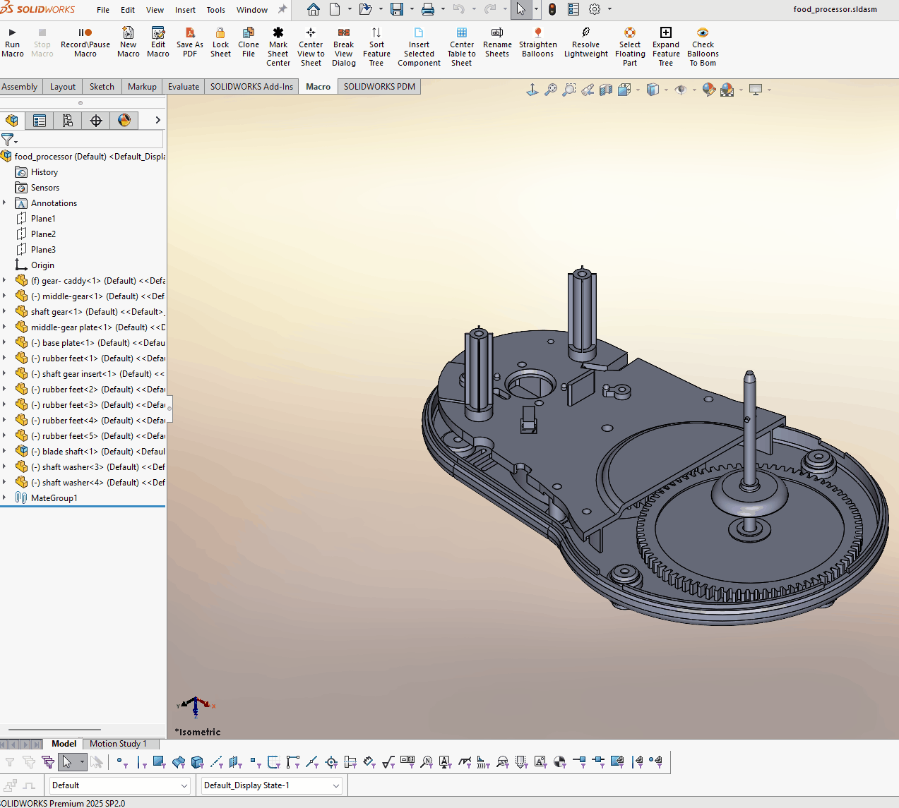

# SelectFloatingPart — SolidWorks Macro

## Purpose
Automatically identifies and selects under‑constrained (floating) **top‑level**
components in a SolidWorks assembly to improve assembly validation and mate
completeness checks.

## Problem
SolidWorks provides an Advanced Component Selection tool that can be configured
to identify components that have mates but remain under‑defined. However, using
this tool requires navigating multiple menus, defining search criteria, and
manually applying filters each time the check is needed.

In large or fastener‑heavy assemblies, repeatedly configuring Advanced Select can
be disruptive to workflow, especially when the intent is simply to perform a
quick, repeatable check for unintentionally floating components during design or
review.

## Solution
This macro encapsulates the Advanced Component Selection logic into a single,
repeatable action.

By directly evaluating the constraint status of **top‑level components only**
(direct children of the root assembly), the macro eliminates the need to open
Advanced Select, define search criteria, and apply filters manually.

The macro focuses exclusively on components that require engineering attention
and ignores fully constrained, fixed, grounded, and Toolbox components by design.

The macro:
- Identifies under‑constrained top‑level components
- Selects floating components in the graphics area
- Eliminates manual Advanced Select setup steps
- Avoids traversing into subassemblies
- Provides non‑blocking progress feedback
- Supports ESC key cancellation
- Executes efficiently, even in large assemblies

## Demo

## How It Works (High‑Level)
1. Macro verifies that an assembly document is active
2. Retrieves the root component of the active configuration
3. Iterates through top‑level child components only
4. Evaluates each component using `GetConstrainedStatus`
5. Selects components that are under‑constrained
6. Displays progress and a final selection summary

## Why This Matters
- Reduces multi‑step Advanced Select workflows to a single action
- Encourages frequent validation during assembly development
- Improves consistency during design reviews
- Scales effectively for large assemblies
- Provides deterministic and repeatable results

## Files
- `SelectFloatingPart.swp` — Executable SolidWorks macro
- `SelectFloatingPart.bas` — Readable source code

*(Development and testing performed using a SolidWorks‑provided sample assembly
included with the standard installation tutorials.)*
