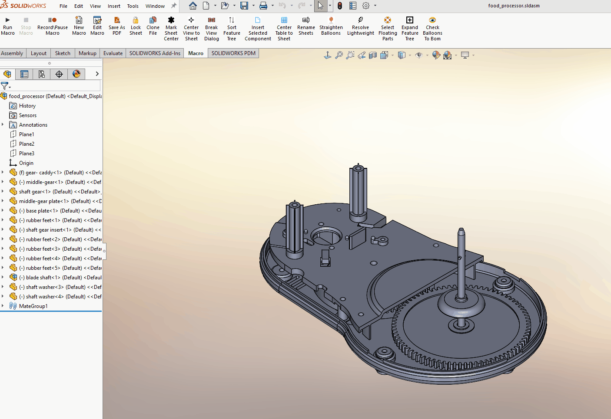

# SortFeatureTree — SolidWorks Macro

## Purpose

Reorders top‑level components in a SolidWorks assembly FeatureManager tree into a
consistent, human‑readable order to make large assemblies easier to navigate.

---

## Problem

In real‑world assemblies, components are often added over time without a strict
order. This results in a FeatureManager tree that is difficult to scan, making it
harder to locate components, identify patterns, or understand overall assembly
structure.

SolidWorks does not provide a built‑in way to sort components intelligently based
on common part‑number naming conventions, particularly when instance numbers are
used.

---

## Solution

This macro automatically sorts **top‑level assembly components** using a logical,
predictable strategy designed around typical mechanical part‑naming schemes.

The macro:

- Includes suppressed components
- Groups components based on how their names begin (numeric vs letter)
- Sorts components by base name and numeric instance order
- Safely reorders the FeatureManager tree using a temporary folder

---

## Sorting Logic

Components are sorted using a two‑stage comparison:

### Primary grouping
- Components whose names begin with a number are listed first
- Components whose names begin with a letter are listed second

### Secondary sorting (within each group)
- Base component names are compared case‑insensitively
- Instance numbers are compared numerically to preserve intuitive ordering

This ensures components appear in an order that aligns with common part‑numbering
and assembly organization practices.

---

## Demo

---

## How It Works (High‑Level)

1. Retrieves the root component of the active configuration
2. Collects all top‑level components, including suppressed components
3. Separates components into numeric‑starting and letter‑starting groups
4. Sorts each group using unified comparison logic
5. Reorders components via a temporary FeatureManager folder
6. Removes the temporary folder and rebuilds the FeatureManager tree

---

## Why This Matters

- Makes large assembly trees easier to read
- Speeds up component lookup
- Preserves intuitive numeric part ordering
- Avoids unsafe or unstable reordering operations
- Demonstrates careful FeatureManager API usage

---

## Compatibility

- SolidWorks assemblies only
- All configurations supported
- Suppressed components included

---

## Files

- `SortFeatureTree.swp` — Executable SolidWorks macro  
- `SortFeatureTree.bas` — Readable source code  
- `SortFeatureTree.gif` — Visual demonstration

---

*Demonstration uses SOLIDWORKS sample assemblies.*
